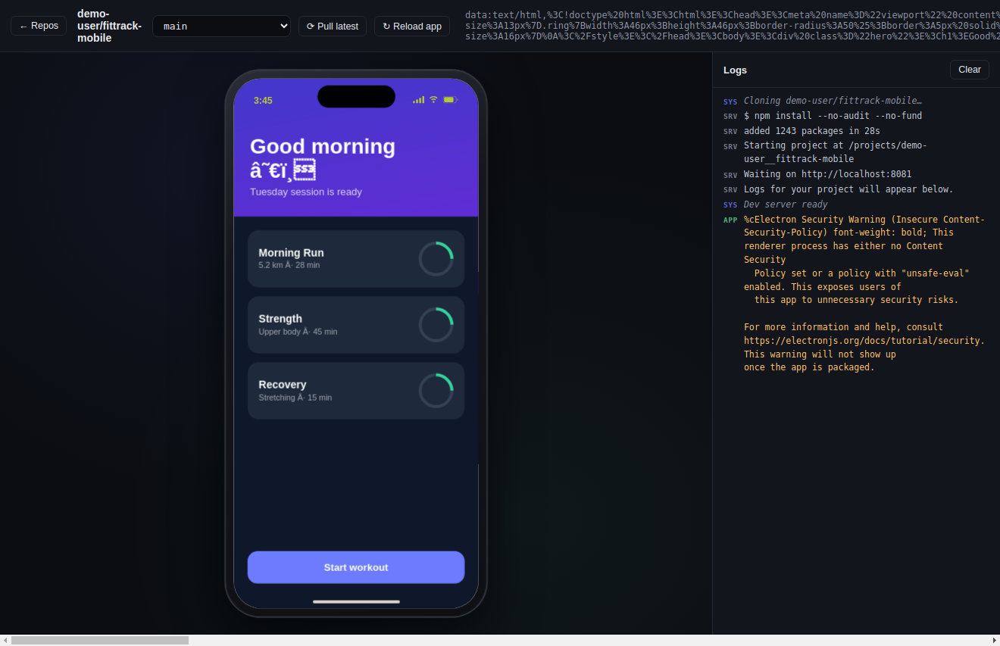
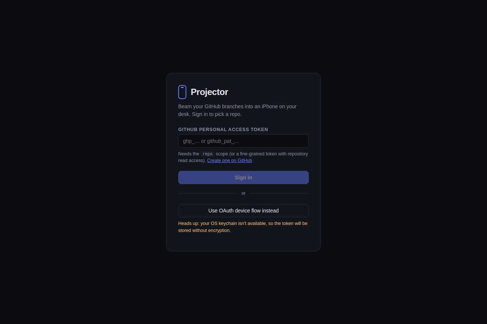
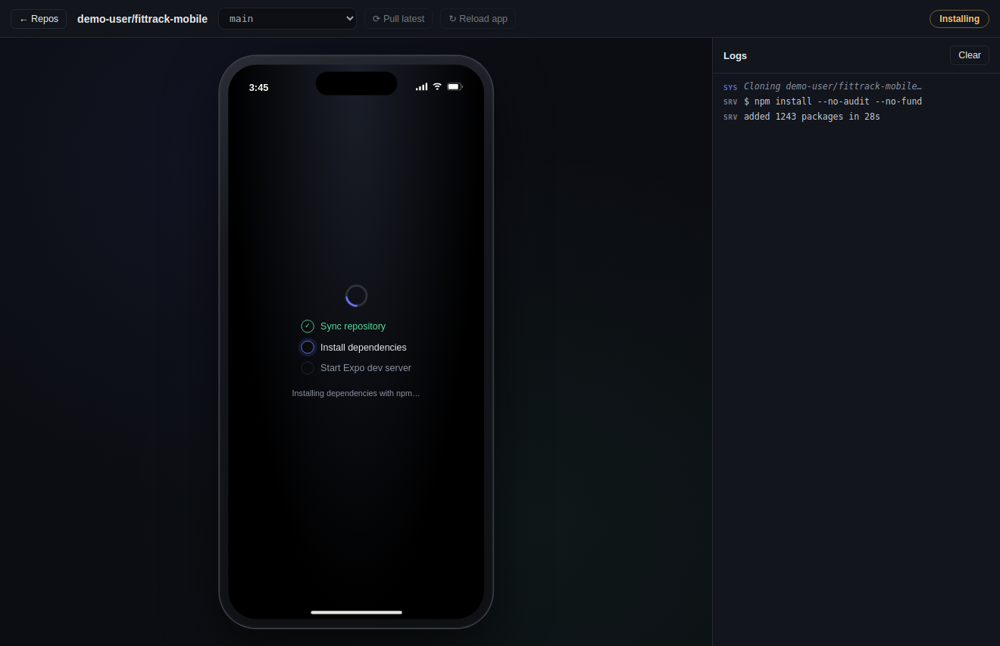

# Projector

**Beam your GitHub branches into an iPhone on your desk.**

Projector is a cross-platform desktop app (Windows / macOS / Linux) for developers building
Expo / React Native apps. Sign in with GitHub, pick a repo and branch, and Projector clones it,
installs dependencies, starts the Expo dev server, and renders the app inside an interactive
iPhone cutout — no physical phone, no QR codes, no Mac required.

Mouse input behaves like fingers: click = tap, drag = swipe. Touch events, the iPhone viewport,
device pixel ratio, and user agent are all emulated through the Chrome DevTools Protocol.

> See [BRIEF.md](./BRIEF.md) for the full project brief, scope, and roadmap.



| Sign in | Pipeline running |
| --- | --- |
|  |  |

## Requirements

- **Node.js 18+** and **git** on your PATH
- A GitHub account (the repos you open need Expo with web support — `expo`, `react-native-web`, `react-dom`)

## Getting started

```bash
npm install
npm run dev        # launch Projector in development mode
```

Other scripts:

```bash
npm run typecheck  # TypeScript checks for main + renderer
npm run build      # compile main/preload/renderer to out/
npm run dist       # build distributable installers with electron-builder
```

## Signing in

Projector supports two auth methods. Tokens are stored encrypted with your OS keychain via
Electron `safeStorage`.

1. **Personal access token (quickest).** Create a token with the `repo` scope
   ([shortcut](https://github.com/settings/tokens/new?scopes=repo&description=Projector)) and paste
   it into the sign-in screen.
2. **OAuth device flow.** Create an OAuth app under GitHub → Settings → Developer settings,
   tick **Enable Device Flow** (no client secret needed), and paste the client ID into the
   sign-in screen. You'll get a short code to enter on github.com/login/device.

## How it works

```
pick repo + branch
   → clone into Projector's cache (blobless partial clone for speed)
   → detect package manager (npm / yarn / pnpm / bun) and install deps
     (skipped when the lockfile hasn't changed)
   → spawn `npx expo start --web` on a free port
   → render http://localhost:<port> in a <webview> inside the iPhone frame
   → CDP: Emulation.setDeviceMetricsOverride + setTouchEmulationEnabled
```

The toolbar lets you switch branches (one click — Projector re-syncs and restarts the server),
pull the latest commits, and reload the frame. The right-hand panel streams three log sources:
`SYS` (Projector pipeline), `SRV` (Expo / Metro dev server), and `APP` (the app's own
`console.*` output, captured from the webview).

Project clones live under Electron's `userData` directory (`projects/<owner>__<repo>`), so
reopening a project is fast and installs are skipped when nothing changed.

## Project structure

```
src/
  main/        Electron main process
    index.ts     window bootstrap
    ipc.ts       IPC handlers + the open-project pipeline
    auth.ts      PAT sign-in, OAuth device flow, safeStorage token store
    github.ts    GitHub REST client (repos, branches, user)
    gitops.ts    clone / fetch / checkout via simple-git
    runner.ts    package-manager detection, installs, Expo dev server, ports
    settings.ts  settings.json, recent projects, clone cache paths
  preload/     typed contextBridge API (window.projector)
  renderer/    React UI
    screens/     SignIn, RepoPicker, Workspace
    components/  DeviceFrame (iPhone cutout), LogsPanel
  shared/      types shared across processes
```

## Known limitations

- Apps run via **react-native-web**, so native-only modules (camera, Bluetooth, some gesture
  handlers) won't function. Fidelity is high for typical UI work, but it is not a simulator.
- Bare React Native repos without web support won't start — Projector surfaces the error
  rather than failing silently.
- One project runs at a time; opening another stops the previous dev server.

## License

MIT
